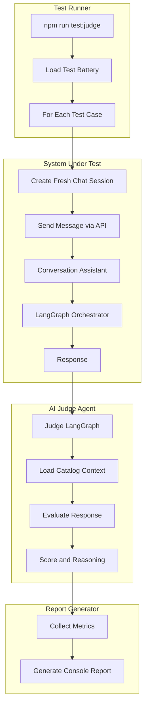
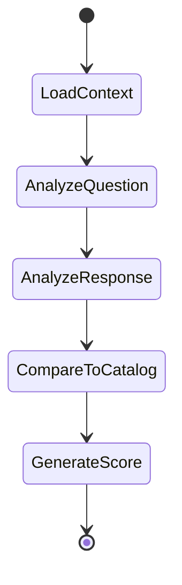

# AI-as-a-Judge Test System Design

## Overview

This document outlines the architecture for implementing a native AI-as-a-Judge testing system for the restaurant chatbot. The system will run via `npm run test:judge` and evaluate the chatbot's responses using another LLM instance acting as a judge.

## Architecture



## Components

### 1. Test Battery - Test Scenarios

The test battery will include 20+ diverse interaction scenarios organized by category:

#### Greeting Scenarios - 3 tests
| ID | Message | Expected Intent |
|----|---------|-----------------|
| G1 | Hola | Greeting response |
| G2 | Buenas tardes | Greeting response |
| G3 | Hey, que tal? | Greeting response |

#### FAQ Scenarios - 5 tests
| ID | Message | Expected Topic |
|----|---------|----------------|
| F1 | Cual es el horario? | hours |
| F2 | Aceptan mercado pago? | payment |
| F3 | Donde estan ubicados? | location |
| F4 | Hacen delivery? | delivery |
| F5 | Como puedo pagar? | payment |

#### Menu Scenarios - 4 tests
| ID | Message | Expected Behavior |
|----|---------|------------------|
| M1 | Que me recomendas? | Show available items |
| M2 | Mustrame el menu | List all products |
| M3 | Que hamburguesas tienen? | Filter by category |
| M4 | Tienen opciones vegetarianas? | Highlight veggie options |

#### Single Order Scenarios - 4 tests
| ID | Message | Expected Behavior |
|----|---------|------------------|
| O1 | Quiero una clasica | Add La Clasica Smash |
| O2 | Mandame dos bacon king | Add 2x Bacon King |
| O3 | Agregame una veggie | Add Veggie Power |
| O4 | Quiero tres hamburguesas | Clarify which burger |

#### Multi-Item Order Scenarios - 3 tests
| ID | Message | Expected Behavior |
|----|---------|------------------|
| MO1 | Quiero una clasica y una veggie | Add both items |
| MO2 | Mandame dos clasicas y un bacon king | Add 3 items total |
| MO3 | Agregame otra clasica mas | Increment existing item |

#### Complete Order Workflow - 3 tests
| ID | Sequence | Expected Outcome |
|----|----------|------------------|
| W1 | Order -> Delivery -> Address -> Payment | Complete order |
| W2 | Order -> Pickup -> Name -> Payment | Complete order |
| W3 | Order -> Add more -> Delivery -> Payment | Complete order |

#### Edge Cases - 3 tests
| ID | Message | Expected Behavior |
|----|---------|------------------|
| E1 | Quiero una pizza | Product not found, suggest alternatives |
| E2 | Cancelar todo | Handle cancellation |
| E3 | Cuanto es? | Show current total |

### 2. Judge Agent - LangGraph Implementation

The Judge Agent will be implemented as a LangGraph workflow:



#### Judge State

```typescript
type JudgeState = {
  question: string;
  response: string;
  catalog: CatalogSnapshot;
  criteria: JudgeCriteria;
  analysis: string;
  score: number;
  reasoning: string;
  tokens: TokenUsage;
  latencyMs: number;
};
```

#### Judge Criteria

The judge will evaluate responses on a 1-5 scale across multiple dimensions:

1. **Relevance** - Does the response address the question?
2. **Accuracy** - Is the information correct per the catalog?
3. **Completeness** - Did it provide all necessary information?
4. **Tone** - Is the tone appropriate - friendly, professional?
5. **Actionability** - Can the user take action based on the response?

### 3. Test Runner

The test runner will:

1. Initialize a fresh conversation for each test
2. Send the test message through the existing API
3. Capture the response and metrics
4. Pass to the Judge Agent
5. Collect all results

```typescript
type TestResult = {
  testCase: TestCase;
  actualResponse: string;
  judgeScore: number;
  judgeReasoning: string;
  tokens: TokenUsage;
  latencyMs: number;
};

type TokenUsage = {
  prompt: number;
  completion: number;
  total: number;
};
```

### 4. Report Generator

The report will output to console with:

```
==========================================
AI-as-a-Judge Test Report
==========================================
Run Date: 2026-03-02T01:45:00Z
Total Tests: 25

SUMMARY
-------
Average Score: 4.2/5.0
Pass Rate: 88% - 22/25 tests scored 3+
Total Tokens: 45,230
  - Prompt: 32,100
  - Completion: 13,130
Total Time: 125.3s
Average Latency: 5.0s per test

CATEGORY BREAKDOWN
------------------
Greetings: 3/3 passed - avg 4.5
FAQ: 4/5 passed - avg 3.8
Menu: 4/4 passed - avg 4.3
Orders: 6/7 passed - avg 4.0
Workflows: 3/3 passed - avg 4.2
Edge Cases: 2/3 passed - avg 3.5

FAILED TESTS
-----------
[F2] Cual es el horario?
  Score: 2/5
  Reason: Response mentioned hours but did not include specific times from catalog
  
[E1] Quiero una pizza
  Score: 2/5
  Reason: Did not suggest available alternatives when product not found
  
[O4] Quiero tres hamburguesas
  Score: 3/5
  Reason: Asked for clarification but could have listed available options

DETAILED RESULTS
----------------
[G1] Hola
  Response: Hola! Bienvenido a RestauLang...
  Score: 5/5
  Tokens: 1,234 - 890 prompt + 344 completion
  Latency: 2.3s
  Reasoning: Excellent greeting, friendly and helpful tone

...more results...

==========================================
```

## File Structure

```
apps/restaurant-hours-api/
├── src/
│   ├── judge/
│   │   ├── judge-agent.ts          # LangGraph judge implementation
│   │   ├── judge-types.ts          # Type definitions
│   │   ├── test-battery.ts         # Test case definitions
│   │   ├── test-runner.ts          # Test execution logic
│   │   └── report-generator.ts     # Console report output
│   └── scripts/
│       └── run-judge-tests.ts      # Entry point for npm script
└── package.json                     # Add test:judge script
```

## Implementation Tasks

### Task 1: Create Judge Types
- Define `JudgeState`, `JudgeCriteria`, `TestResult`, `TestCase` types
- Define token tracking interfaces

### Task 2: Implement Judge Agent
- Create LangGraph workflow for judge evaluation
- Implement context loading from catalog
- Implement scoring logic with Gemma3-27B
- Add token and timing tracking

### Task 3: Create Test Battery
- Define all 25+ test cases
- Organize by category
- Include expected outcomes

### Task 4: Implement Test Runner
- Create test execution engine
- Integrate with existing API via HTTP calls
- Handle fresh session creation
- Collect metrics per test

### Task 5: Implement Report Generator
- Format console output
- Calculate aggregate statistics
- Highlight failures with reasoning
- Display token and timing metrics

### Task 6: Add npm Script
- Add `test:judge` script to package.json
- Wire up entry point

### Task 7: Integration Testing
- Verify end-to-end flow
- Validate report output
- Test with real catalog data

## Technical Details

### API Integration

Tests will call the existing `/message` endpoint:

```typescript
async function sendMessage(chatId: string, text: string): Promise<Response> {
  const response = await fetch('http://localhost:3000/message', {
    method: 'POST',
    headers: { 'Content-Type': 'application/json' },
    body: JSON.stringify({ chatId, message: text })
  });
  return response.json();
}
```

### Judge Prompt Template

```
You are an impartial judge evaluating a restaurant chatbot response.

CATALOG CONTEXT:
Products: ${JSON.stringify(catalog.products)}
FAQ: ${JSON.stringify(catalog.faq)}

USER QUESTION: ${question}

BOT RESPONSE: ${response}

Evaluate the response on these criteria - 1-5 scale:
1. Relevance: Does it address the question?
2. Accuracy: Is the information correct per catalog?
3. Completeness: Is all necessary info provided?
4. Tone: Is it friendly and professional?
5. Actionability: Can user take action?

Provide:
- Overall score - 1-5
- Brief reasoning for score
- Specific issues if any

Format your response as JSON:
{
  "score": 4,
  "reasoning": "Brief explanation",
  "criteria": {
    "relevance": 5,
    "accuracy": 4,
    "completeness": 4,
    "tone": 5,
    "actionability": 4
  }
}
```

## Success Criteria

1. All 25+ test cases execute without errors
2. Judge provides meaningful scores and reasoning
3. Report clearly shows pass/fail status
4. Token usage is tracked and displayed
5. Timing metrics are accurate
6. System uses full LangGraph/LangChain implementation
